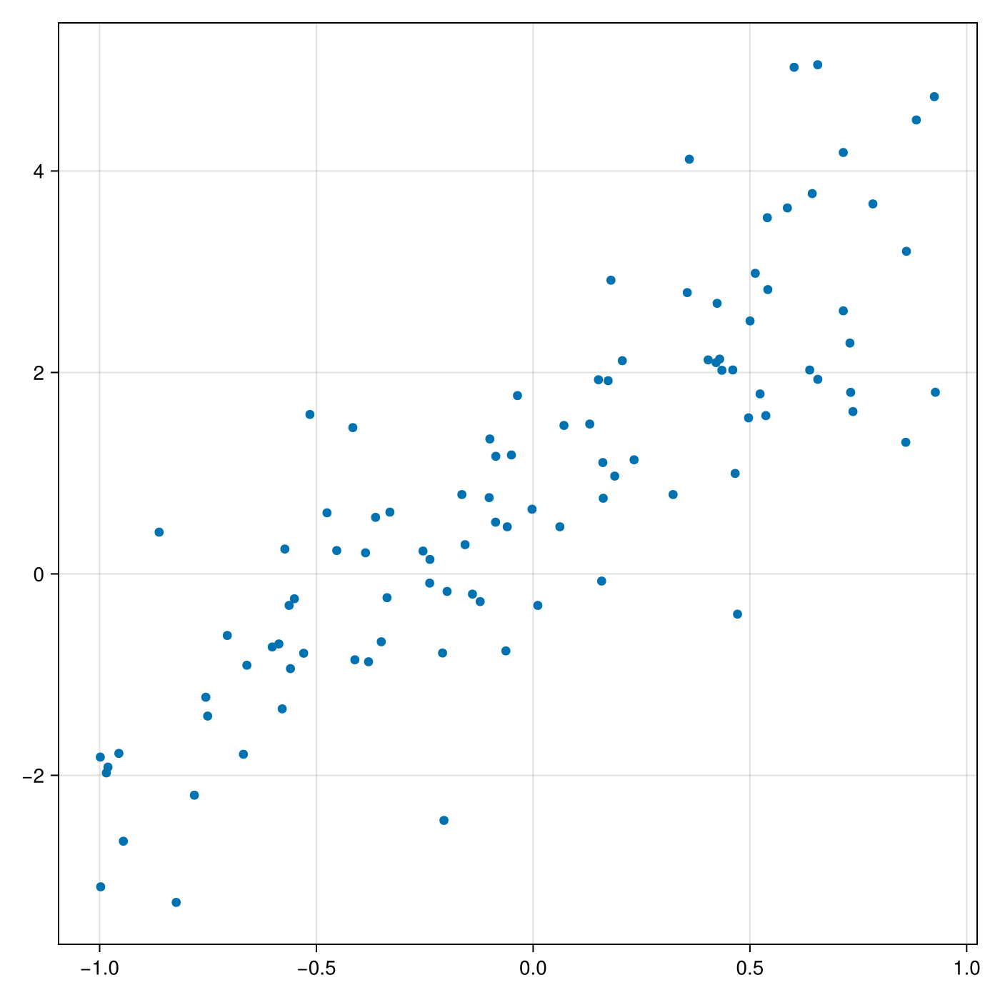
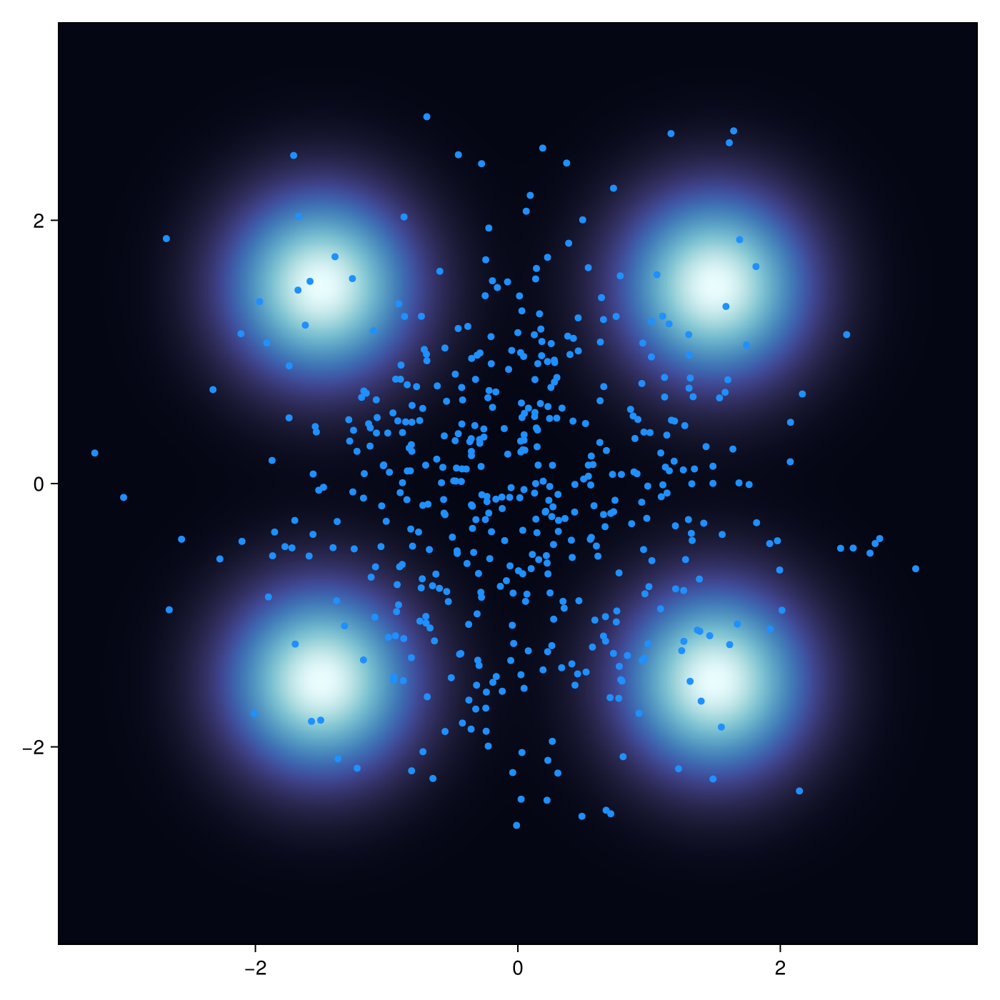
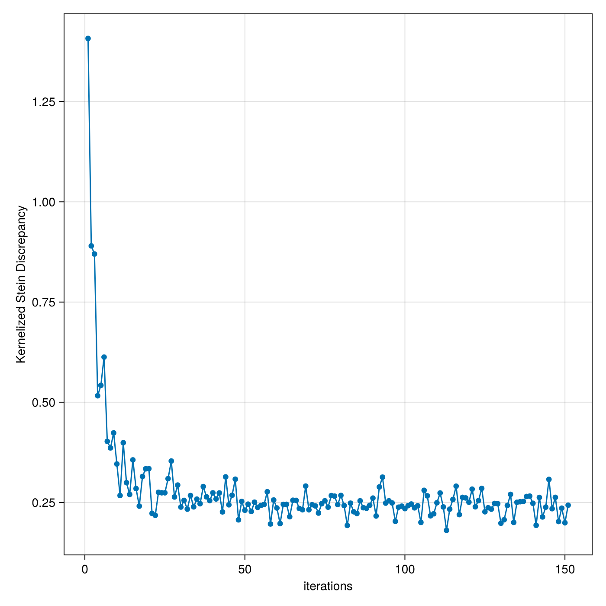
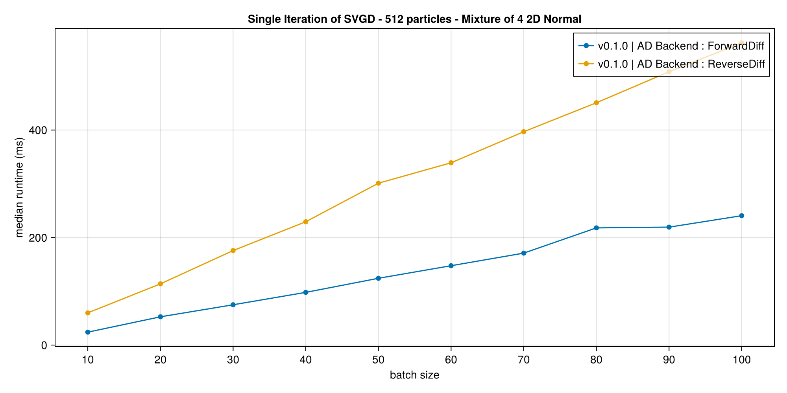

[](https://github.com/BayesianRL/NonparametricVI.jl/actions/workflows/CI.yml?query=branch%3Amain)
[](https://bayesianrl.github.io/NonparametricVI.jl/dev/)
[](https://doi.org/10.5281/zenodo.15154383)
[](https://github.com/JuliaTesting/Aqua.jl)


# NonparametricVI.jl
NonparametricVI.jl is a collection of particle-based and nonparametric variational methods for approximate Bayesian inference in Julia. You can use it either with [Turing.jl](https://turinglang.org/) probabilistic programming language or other custom sampling problems defined by [LogDensityProblems.jl](https://github.com/tpapp/LogDensityProblems.jl). Another application of this package is to improve the quality of samples obtained from other methods, For example most MCMC methods tend to produce correlated samples leading to a low effective sample size. In such cases, the samples can be decorrelated using any suitable particle-based approach.

## From Parametric to Nonparametric Variational Inference
The idea of Variational Inference (VI) is to approximate a target posterior density using a parametric family of probability distibutions by choosing the most fitting member of this family through solving an optimization problem. This approach turns out to be more scalable than MCMC methods especially for models with large number of latent variables. However the main challenge with standard VI is choosing the suitable parametric family. Very simple densities can underestimate the posterior while more complex choices can be computationally infeasible. On the other hand, nonparametric or particle-based VI methods do not require a parametric family and instead try to approximate the posterior by arranging the positions of a set of particles in a way that the particles resemble samples from the target density.

https://github.com/user-attachments/assets/3dc29684-2642-4dd2-8be3-3e402de744d2


## Getting Started
### Installation
NonparametricVI.jl is under development, you can install the latest version from this repository using Pkg:
```julia
Pkg.add(url="https://github.com/BayesianRL/NonparametricVI.jl.git")
```
Or the latest registered version from Julia general repository:
```julia
Pkg.add("NonparametricVI")
```

### Using with Turing.jl Probabilistic Programs
#### Example: Linear Regression
Let's craft a toy regression problem:
```julia
using DynamicPPL
using Distributions
using NonparametricVI
using LinearAlgebra
using KernelFunctions
using CairoMakie

n = 100
X = 2rand(n) .- 1.0
y = 3X .+ 1 + randn(n)
```

The generated problem looks like this:
<p align="center">
    
</p>
We start by defining a simple Turing.jl model for regression and instantiate it:

```julia
@model function bayesian_regression(X, y)
    α ~ Normal(0.0, 1.0)
    β ~ Normal(0.0, 1.0)

    for i in eachindex(y)
        y[i] ~ Normal(α * X[i] + β, 0.5)
    end
end

model = bayesian_regression(X, y)
```

To define the dynamics of Stein Variational Gradient Descent (SVGD), we need a positive-definite kernel. You can use all kernels provided by [KernelFunctions.jl](https://github.com/JuliaGaussianProcesses/KernelFunctions.jl). We use a squared exponential kernel. For more details on designing more complex kernels, check out [KernelFunctions.jl](https://github.com/JuliaGaussianProcesses/KernelFunctions.jl) documentation:  
```julia
using KernelFunctions
kernel = SqExponentialKernel()
```

Next we define the parameters of `SVGD`:  

```julia
dynamics = SVGD(K=kernel, η=0.003, batchsize=32)
```

Nonparametric Variational Inference methods use a set of particles instead of a parametric family of distribution to approximate posterior (or any target) distribution. The `init` method creates the particles `pc`, in addition to an internal context `ctx` which will be used by the inference procedure.

```julia
pc, ctx = init(model, dynamics; n_particles=128)
```

`pc` is a simple struct containing position of particles. Using `get_samples` we can access the particles and plot them:
```julia
samples = get_samples(pc, ctx)
α_samples = [s[@varname(α)] for s in samples]
β_samples = [s[@varname(β)] for s in samples];
```
Note that some Turing models may contain constrained parameters (e.g. positive, bounded, ...) while most inference methods are performed on an unconstrained space obtained by transforming the original denisty of parameters. The `get_samples` method transforms the particle positions back to the contrained space. Before running SVGD we can visualize the current state of particles:  

<p align="center">
    
</p>

By default the initial particles will be sampled from prior. One can use other approaches, 
for example we can initialize particles with `10` steps of Langevin dynamics with an step size of `0.002`: 

```julia
pc, ctx = NonparametricVI.init(model, dynamics;
                               n_particles=128,
                               particle_initializer=LangevinInitializer(0.002, 10))

```

With Langevin initialization, particles will look like this:

<p align="center">
    
</p>

Intuitively, Langevin dynamics is very local and only uses *attraction* forces for adjusting particles and to prevent particles from collapsing on a model relies on an additive Gaussian noise. SVGD not only uses attraction but also uses *repulsion* forces to transport the particles in order to improve the quality of samples. While SVGD can be used standalone (see the next example), it is computationally more expensive so it is sometimes a good idea to initialize particles with a simpler dynamics like Langevin. 

Note the `infer!` method modifies the particles in-place.
```julia
infer!(pc, ctx; iters=50)
```

After collecting samples with `get_samples` we can visualize the final result:
<p align="center">
    
</p>


### Using with `LogDensityProblems`
#### Example: A Mixture Density
In addtion to Turing programs, you can use NonparametricVI for a custom Bayesian inference problem by implementing the [`LogDensityProblems`](https://github.com/tpapp/LogDensityProblems.jl) interface. For example here we define a toy unnormalized mixture density:
```julia
using LogDensityProblems

struct MixtureDensity end

function LogDensityProblems.capabilities(::Type{<:MixtureDensity})
    LogDensityProblems.LogDensityOrder{0}()
end

LogDensityProblems.dimension(::MixtureDensity) = 2

function LogDensityProblems.logdensity(::MixtureDensity, x)
    log(0.25 * exp(-1/0.5 * norm(x-[-1.5, -1.5])^2) +
        0.25 * exp(-1/0.5 * norm(x-[-1.5,  1.5])^2) +
        0.25 * exp(-1/0.5 * norm(x-[ 1.5, -1.5])^2) +
        0.25 * exp(-1/0.5 * norm(x-[ 1.5,  1.5])^2))
end

ρ = MixtureDensity()
```

Next we define the inference dynamics by choosing a custom kernel. It can be any kernel provided by [KernelFunctions.jl](https://github.com/JuliaGaussianProcesses/KernelFunctions.jl). Here we use a scaled version of the squared exponential kernel:
```julia
kernel = SqExponentialKernel() ∘ ScaleTransform(2.0)
dynamics = SVGD(K=kernel, η=0.4, batchsize=16)
```

Now we create a set of particles that represent samples:
```julia
pc, ctx = init(ρ, dynamics; n_particles=512)
```
We can access particle positions by `get_samples` and visualize the their current position:
```julia
S = get_samples(pc)
```

<p align="center">
    
</p>

Obviously the initial samples does not match the target density. Now we run the `SVGD` dynamics to adjust the samples:

```julia
report = infer!(pc, ctx; iters=150, track=Dict(
    "KSD" => KernelizedSteinDiscrepancy(kernel, 64)
));
S = get_samples(pc)
```  

The above code also tracks the value of [Kernelized Stein Discrepancy](https://proceedings.mlr.press/v48/liub16.html) (KSD) during inference. Since KSD can be expensive to compute, we use a Monte Carlo estimation with `64` particles sampled at each step. After inference we can access the tracked values using `report.metrics["KSD"]` and plot it:

<p align="center">
    
</p>

Finally we can check the terminal position of particles:
<p align="center">
    
</p>

## Implemented Methods

| Method            | 📝 Paper                                            | Support       | Notes               |
|----------------------------|---------------------------------------------------------|---------------|---------------------|
| Stein Variational Gradient Descent | 📔 [Stein Variational Gradient Descent: A General Purpose Bayesian Inference Algorithm](https://arxiv.org/abs/1608.04471) ✏️ Qiang Liu, Dilin Wang         | ✅ Basic functionality           |  Accuracy is sensitive to kernel choice. see [`SVGD`](https://bayesianrl.github.io/NonparametricVI.jl/dev/api/#NonparametricVI.SVGD)  |
| Stein Variational Newton method | 📔 [A Stein variational Newton method](https://arxiv.org/abs/1806.03085) ✏️ Gianluca Detommaso, Tiangang Cui, Alessio Spantini, Youssef Marzouk, Robert Scheichl         | 🚧 todo           |  |
| Projected Stein Variational Newton | 📔 [Projected Stein Variational Newton: A Fast and Scalable Bayesian Inference Method in High Dimensions](https://arxiv.org/abs/1901.08659) ✏️ Peng Chen, Keyi Wu, Joshua Chen, Thomas O'Leary-Roseberry, Omar Ghattas         | 🚧 todo           |  |
| Stein Self-Repulsive Dynamics | 📔 [Stein Self-Repulsive Dynamics: Benefits From Past Samples](https://arxiv.org/abs/2002.09070) ✏️ Mao Ye, Tongzheng Ren, Qiang Liu         | 🚧 todo           |  |
| SPH-ParVI | 📔 [Variational Inference via Smoothed Particle Hydrodynamics](https://arxiv.org/abs/2407.09186) ✏️ Yongchao Huang         | 🚧 todo           |  |
| MPM-ParVI | 📔 [Variational Inference Using Material Point Method](https://arxiv.org/abs/2407.20287)  ✏️ Yongchao Huang        | 🚧 todo           |  |
| EParVI | 📔 [Electrostatics-based particle sampling and approximate inference](https://arxiv.org/abs/2406.20044) ✏️ Yongchao Huang         | 🚧 todo           |  |

## Performance Tracking (v0.1.0)
Here you can find performance evaluations for inference methods and also trackable metrics like KSD like compared to the previous versions:
### Inference Methods
#### SVGD
<p align="center">
    
</p>

### Metrics
#### KSD
<p align="center">
    
</p>

## About
If you found this project useful in your research, please cite it as follows:
```BibTeX
@software{NonparametricVI,
    author = {Asadi, Amirabbas},
    doi = {10.5281/zenodo.15154383},
    title = {{NonparametricVI, Particle-Based and Nonparametric Variational Methods for Bayesian Inference}},
    url = {https://github.com/BayesianRL/NonparametricVI.jl},
    version = {0.1.0},
    year = {2025}
}
```